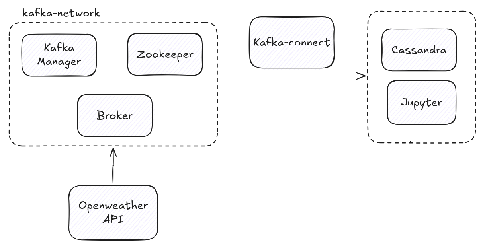

# SFUMPT Clone - Data Pipeline
The point is to learn data pipelining by cloning online resources.

## Source
- [Original article](https://medium.com/sfu-cspmp/building-data-pipeline-kafka-docker-4d2a6cfc92ca#ed5b) 
- [Original github](https://github.com/salcaino/sfucmpt733)
- [Kafka broker image](https://hub.docker.com/r/wurstmeister/kafka)
- [Kafka Connector](https://hub.docker.com/r/confluentinc/cp-kafka-connect-base/)

## Key components
- Producers: Openweather API
- Pipeline: Kafka, Confluent Client (connector)
- Warehouse: Cassandra
- Visualizer: Jupyter Notebook

Have yet to installed:
- [ ] Twitter API
- [ ] Twitter Sentiment Analysis

